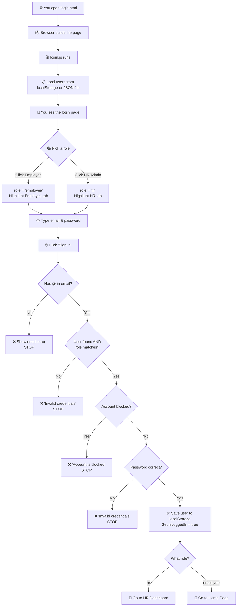

# 🧒 Your Login Flow — Explained Like You're 3 Years Old

---

## 🎬 STEP 0 — The Page Wakes Up (Before you even see anything)

When you open `login.html` in your browser, two important things happen at the **very bottom of `<head>`**:

```html
<!-- line 26 --> <script src="animations.js" defer></script>
<!-- line 29 --> <script src="login.js" defer></script>
```

The word **`defer`** means: *"Hey browser, build the entire page first (all the buttons, inputs, everything), and THEN run my JavaScript."*

So the browser:
1. 🏗️ Builds the **entire HTML** — every button, every input, the modal, everything.
2. 🎬 THEN runs `animations.js` (the fancy badge swinging stuff).
3. 🎬 THEN runs `login.js` — **this is where all your login logic lives**.

---

## 📦 STEP 1 — Getting the Users List (login.js, Lines 1–7)

The **very first thing** your JS does when it runs:

```js
// line 2
let users = JSON.parse(localStorage.getItem("users")) || [];
```

Think of `localStorage` as a **little drawer in your browser** 🗄️. Your code opens that drawer and looks for something labeled `"users"`.

- **If the drawer has users** → Great! We grab them and put them in a variable called `users`.
- **If the drawer is empty** (`|| []`) → We get an empty list for now.

Then:

```js
// lines 3-7
if (!users.length) {
  fetch("../jsonFiles/Users.json")
    .then(res => res.json())
    .then(data => { users = data; localStorage.setItem("users", JSON.stringify(data)); });
}
```

If the list is empty (no users in the drawer), the code goes and **fetches** them from a JSON file (`Users.json`) — like going to the storage room 📁 to get the list. Once it gets them, it:
1. Puts them in the `users` variable (so we can use them right now).
2. **Saves them in the drawer** (`localStorage`) so next time we don't need to go to the storage room again.

---

## 🎭 STEP 2 — You Choose: Employee or HR (The Role Tabs)

Now you see the page! There are **two buttons** at the top of the form:

```html
<!-- line 277 -->
<button type="button" id="navEmployee" class="role-switch-btn active" onclick="switchToEmployee()">
  Employee
</button>

<!-- line 285 -->
<button type="button" id="navHR" class="role-switch-btn" onclick="switchToHR()">
  HR Admin
</button>
```

Notice:
- **Employee** starts with the class `active` (it's already highlighted/selected by default).
- Each button has an **`onclick`** — meaning *"when you click me, run this function"*.

### What happens when you click "Employee"?

The HTML says `onclick="switchToEmployee()"`, so the browser runs this function in `login.js`:

```js
// lines 10-15
let role = "employee";  // ← starts as "employee" by default

function switchToEmployee() {
  role = "employee";                                              // set the role variable
  document.getElementById("navEmployee").classList.add("active"); // highlight Employee button
  document.getElementById("navHR").classList.remove("active");    // un-highlight HR button
}
```

**In baby terms:** You picked the "Employee" sticker 🏷️. The code remembers your choice in a variable called `role`, and it makes the Employee button look selected (adds the `active` class which makes it look highlighted via CSS).

### What happens when you click "HR Admin"?

Same idea, opposite direction:

```js
// lines 16-20
function switchToHR() {
  role = "hr";                                                    // set role to "hr"
  document.getElementById("navHR").classList.add("active");       // highlight HR button
  document.getElementById("navEmployee").classList.remove("active"); // un-highlight Employee
}
```

> **Key takeaway:** The `role` variable is just a string — either `"employee"` or `"hr"`. It will be checked later when you try to log in to make sure you picked the right door.

---

## 📝 STEP 3 — The Form Inputs Get Grabbed (login.js, Lines 22–26)

Right after the role functions, the code grabs references to the HTML elements it'll need later:

```js
// lines 23-26
let emailInput = document.getElementById("loginEmail");     // the email text box
let passInput  = document.getElementById("loginPassword");  // the password text box
let emailErr   = document.getElementById("emailError");     // the red error text under email
let passErr    = document.getElementById("passwordError");  // the red error text under password
```

These match these HTML elements:

| JS Variable | HTML Element (id) | What it is |
|---|---|---|
| `emailInput` | `loginEmail` ([line 301](file:///c:/Users/ghaith/Desktop/TASKMANAEMENTSYS/GAITH/login.html#L301)) | The email `<input>` |
| `passInput` | `loginPassword` ([line 312](file:///c:/Users/ghaith/Desktop/TASKMANAEMENTSYS/GAITH/login.html#L312)) | The password `<input>` |
| `emailErr` | `emailError` ([line 306](file:///c:/Users/ghaith/Desktop/TASKMANAEMENTSYS/GAITH/login.html#L306)) | Hidden red error `<div>` under email |
| `passErr` | `passwordError` ([line 323](file:///c:/Users/ghaith/Desktop/TASKMANAEMENTSYS/GAITH/login.html#L323)) | Hidden red error `<div>` under password |

The error divs start with `style="display: none;"` in the HTML — they're **invisible** until the code decides to show them.

---

## 👁️ STEP 4 — The Show/Hide Password Button (login.js, Lines 28–32)

In the HTML there's a little eye icon button:

```html
<!-- line 318-322 -->
<button type="button" id="togglePasswordBtn" ...>
  <i class="bi bi-eye-slash" id="toggleIcon"></i>
</button>
```

And in JS:

```js
// lines 29-32
document.getElementById("togglePasswordBtn").onclick = () => {
  passInput.type = passInput.type === "password" ? "text" : "password";
  document.getElementById("toggleIcon").className =
    passInput.type === "text" ? "bi bi-eye" : "bi bi-eye-slash";
};
```

**In baby terms:** 
- You click the eye 👁️ button.
- If the password is **hidden** (dots: `••••`), it changes the input type from `"password"` to `"text"` → now you can **see** the password, and the icon changes to an open eye 👁️.
- If the password is **visible**, it changes back to `"password"` → dots again, and the icon goes back to a slashed eye 🙈.

---

## 🧹 STEP 5 — Error Messages Disappear When You Type (Lines 34–36)

```js
// lines 35-36
emailInput.oninput = () => emailErr.style.display = "none";
passInput.oninput  = () => passErr.style.display = "none";
```

**In baby terms:** If you got a red error message and then you start typing again, the error goes away. It's like erasing the red mark ❌ from your homework when you start fixing it.

---

## 🔍 STEP 6 — The `findUser` Function (Lines 38–48)

This function is the **search helper**. It takes an email and looks for a matching user:

```js
function findUser(email) {
  // First, look in the "Employees" drawer (localStorage)
  let employees = JSON.parse(localStorage.getItem("Employees")) || [];
  for (let i = 0; i < employees.length; i++) {
    if ((employees[i].email || "").trim().toLowerCase() === email) return employees[i];
  }
  // If not found, look in the "users" list (from Step 1)
  for (let i = 0; i < users.length; i++) {
    if ((users[i].email || "").trim().toLowerCase() === email) return users[i];
  }
  return null; // nobody found 😢
}
```

**In baby terms:** Imagine you have **two toy boxes** 🧸🧸:
1. **Box 1** = `"Employees"` in localStorage (maybe users added by the HR dashboard).
2. **Box 2** = `users` (the original list from the JSON file).

You look in Box 1 first. If you find the person there, great, you're done! If not, you look in Box 2. If they're not in either box, you return `null` (nobody home 🏠).

---

## 🚀 STEP 7 — THE BIG MOMENT: You Click "Sign In" (Lines 50–86)

This is the **main event**. In the HTML, there's a form:

```html
<!-- line 297 -->
<form id="hrLoginForm" novalidate>
  ... email input ... password input ... 
  <!-- line 336-341 -->
  <button type="submit" id="loginSubmitBtn">Sign In to Portal</button>
</form>
```

When you click that "Sign In" button, because it's `type="submit"` inside a `<form>`, the browser fires a **submit event** on the form. The JS catches it:

```js
// line 51
document.getElementById("hrLoginForm").onsubmit = (e) => {
  e.preventDefault(); // ← STOP! Don't refresh the page!
```

`e.preventDefault()` is like telling the browser: *"Don't do your default thing (reloading the page). I'll handle this myself."*

### Now, the validation checks happen one by one, like a bouncer at a club 🕶️:

#### Check 1: Is the email valid? (Lines 55–59)

```js
let email = emailInput.value.trim().toLowerCase();

if (!email.includes("@")) {
  emailErr.textContent = "Enter a valid email.";
  emailErr.style.display = "block";   // show the red error
  return;                              // STOP here, don't continue
}
```

**In baby terms:** Does your email have an `@` sign? No? ❌ Show a red message and **stop everything**. You can't go further.

#### Check 2: Find the user & check the role (Lines 61–70)

```js
let user = findUser(email);  // use our search helper from Step 6

// Check for a changed password (from "forgot password" feature)
let savedPass = (JSON.parse(localStorage.getItem("user_passwords")) || {})[email];
let correctPass = savedPass || (user ? user.password : "");

if (!user || user.role !== role) {
  passErr.textContent = "Invalid credentials or role.";
  passErr.style.display = "block";
  return;  // STOP
}
```

Two things are checked:
1. **Does this user even exist?** (`!user`) — If `findUser` returned `null`, you're out ❌.
2. **Does the user's role match what you selected?** — Remember the `role` variable from Step 2? If you clicked "Employee" but this user is an `"hr"` in the data, it won't match → ❌ rejected.

Also notice the `correctPass` line — it first checks if the user changed their password through "forgot password" (stored in a special `"user_passwords"` drawer). If they did, use the new one. If not, use the original password from the user data.

#### Check 3: Is the account blocked? (Lines 71–75)

```js
if (user.status === "Blocked") {
  passErr.textContent = "Account is blocked.";
  passErr.style.display = "block";
  return;  // STOP
}
```

**In baby terms:** Even if we found you, if you've been put in **time-out** (blocked by HR) 🚫, you can't come in.

#### Check 4: Is the password correct? (Lines 76–80)

```js
if (passInput.value !== correctPass) {
  passErr.textContent = "Invalid credentials or role.";
  passErr.style.display = "block";
  return;  // STOP
}
```

**In baby terms:** Is the secret word you typed the same as the one we have on file? No? ❌ Wrong password.

#### ✅ ALL CHECKS PASSED! (Lines 82–86)

If you made it past ALL four bouncers, congratulations! 🎉

```js
localStorage.setItem("currentUser", JSON.stringify(user));   // save who you are
localStorage.setItem("isLoggedIn", "true");                   // remember you're logged in
window.location.href = role === "hr" 
  ? "../NADA/hrdashboard/hrdashboard.html"   // HR goes to HR dashboard
  : "../NADA/home/home.html";                 // Employee goes to home page
```

Three things happen:
1. **Save the current user** in localStorage — so other pages know who's logged in.
2. **Set a flag** `"isLoggedIn"` = `"true"` — like putting a stamp on your hand 🖐️✅.
3. **Redirect you** — if you're HR, you go to the HR dashboard. If you're an employee, you go to the home page.

---

## 🔑 STEP 8 — Forgot Password Flow (Lines 88–148)

### Opening the modal (Lines 96–102)

In the HTML:
```html
<!-- line 329 -->
<a href="#" id="forgotPasswordLink">Forgot password?</a>
```

In JS:
```js
document.getElementById("forgotPasswordLink").onclick = (e) => {
  e.preventDefault();                          // don't follow the # link
  modal.style.display = "block";               // show the modal box
  modal.classList.add("show");                  // add Bootstrap's show animation
  resetEmail.value = emailInput.value;          // auto-fill with whatever email they already typed
};
```

**In baby terms:** You click "Forgot password?" → a popup box appears 📦. If you already typed your email in the login form, it copies it into the popup for you (how nice!).

### Step 1 of the modal: Verify your email (Lines 114–130)

When you click "Verify Email" in the modal:

```js
document.getElementById("forgotPasswordForm").onsubmit = (e) => {
  e.preventDefault();
  let found = findUser(resetEmail.value.trim().toLowerCase());

  if (newPassSec.classList.contains("d-none")) {  // if we're still on step 1
    if (!found) {
      // show "User not found" error
      return;
    }
    // User found! Show their name, hide the email field, show the password fields
    emailGroup.classList.add("d-none");           // hide email input
    verifiedBadge.classList.remove("d-none");      // show green "✅ Account Verified" badge
    document.getElementById("verifiedUserName").textContent = found.name;
    newPassSec.classList.remove("d-none");          // show new password fields
    submitText.textContent = "Save Password";      // change button text
  }
```

**In baby terms:** You type your email and click verify. The code searches for you (using `findUser`). If it finds you, it shows a green checkmark ✅ with your name and reveals two new password fields. The button text changes from "Verify Email" to "Save Password".

### Step 2 of the modal: Set new password (Lines 131–147)

When you click "Save Password":

```js
  } else {
    // We're on step 2 now
    let p1 = document.getElementById("newPasswordInput").value;
    let p2 = document.getElementById("confirmPasswordInput").value;
    
    if (!p1 || p1 !== p2) {
      // show "Passwords do not match" error
      return;
    }
    
    // Save the new password
    let passMap = JSON.parse(localStorage.getItem("user_passwords")) || {};
    passMap[found.email.toLowerCase()] = p1;
    localStorage.setItem("user_passwords", JSON.stringify(passMap));
    
    // Auto-fill the login form with the email and new password
    emailInput.value = found.email;
    passInput.value = p1;
    emailInput.dispatchEvent(new Event("input"));  // trigger input event to clear errors
    
    // Close the modal
    document.getElementById("closeForgotModalBtn").click();
  }
```

**In baby terms:** You type a new password twice. If they don't match → ❌ error. If they match → the code saves the new password in a special drawer called `"user_passwords"` in localStorage. Then it's extra nice and **fills in** the login form for you with your email and new password, and closes the popup. All you have to do now is click "Sign In"! 🎉

### Closing the modal (Lines 104–112)

```js
document.getElementById("closeForgotModalBtn").onclick = () => {
  modal.style.display = "none";         // hide the modal
  modal.classList.remove("show");       // remove animation class
  newPassSec.classList.add("d-none");   // hide password fields (reset for next time)
  emailGroup.classList.remove("d-none"); // show email field again
  verifiedBadge.classList.add("d-none"); // hide the verified badge
  submitText.textContent = "Verify Email"; // reset button text
};
```

Everything gets reset back to its starting state, so next time you open the modal, it starts fresh from step 1.

---

## 🗺️ The Complete Flow — Visual Summary



---

## 🔗 How HTML & JS Talk to Each Other — Quick Reference

| What you do | HTML Element | JS Connects via | JS Does |
|---|---|---|---|
| Open page | `<script defer>` | Auto-runs | Loads users from localStorage/JSON |
| Click Employee tab | `onclick="switchToEmployee()"` | `onclick` attribute | Sets `role = "employee"`, toggles `active` class |
| Click HR tab | `onclick="switchToHR()"` | `onclick` attribute | Sets `role = "hr"`, toggles `active` class |
| Type in email | `<input id="loginEmail">` | `emailInput.oninput` | Hides email error message |
| Type in password | `<input id="loginPassword">` | `passInput.oninput` | Hides password error message |
| Click eye icon | `<button id="togglePasswordBtn">` | `.onclick` | Toggles password visibility |
| Click Sign In | `<form id="hrLoginForm">` `<button type="submit">` | `.onsubmit` | Validates → finds user → checks role → checks blocked → checks password → redirects |
| Click Forgot Password | `<a id="forgotPasswordLink">` | `.onclick` | Opens the reset modal |
| Submit reset form | `<form id="forgotPasswordForm">` | `.onsubmit` | Step 1: verify email. Step 2: save new password |

