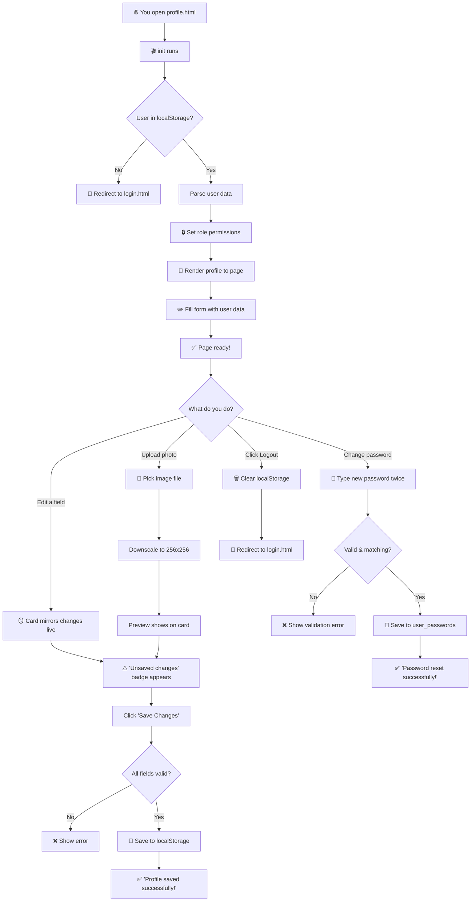

# 🧒 Your Profile Page — Explained Like You're 3 Years Old

---

## 🎬 STEP 0 — The Page Wakes Up

When you open `profile.html`, two important things happen:

1. 🏗️ The browser builds the entire HTML page (cards, forms, inputs, buttons).
2. 🎬 Then it runs `profile.js` — **this is where all your profile logic lives**.

At the **very bottom** of `profile.js`, this line tells the browser *"once everything is ready, start the profile"*:

```js
// line 373
document.addEventListener('DOMContentLoaded', init);
```

So the function `init()` is the **starting point** of everything.

---

## 📋 STEP 1 — State Variables (Line 3)

The very first things the code sets up are three "memory slots":

```js
// line 3
var currentUser = null, stagedAvatar = '', savedState = { name: '', position: '', department: '', phone: '', avatar: '' };
```

| Variable | What it is |
|---|---|
| `currentUser` | The person who's logged in (starts empty, filled later) |
| `stagedAvatar` | The current profile picture (could be a new one they uploaded but haven't saved yet) |
| `savedState` | Remembers what the form looked like LAST TIME you saved — used to detect unsaved changes |

**In baby terms:** These are like three empty sticky notes 📝. The code will write on them later.

---

## 🏷️ STEP 2 — Grabbing All the HTML Elements (Lines 6–32)

The code grabs **every** HTML element it'll need later:

```js
// lines 6-7
var navRoleBadge = document.getElementById('navRoleBadge'), navRoleText = document.getElementById('navRoleText');
var navAvatarImg = document.getElementById('navAvatarImg'), navUserName = document.getElementById('navUserName');
// ... and so on for about 25 more elements
```

**In baby terms:** Imagine you're setting up a workstation 🛠️. Before you start working, you grab ALL your tools and lay them on the table — screwdriver, hammer, tape, etc. That's what this does. It grabs references to every button, input, image, and error message on the page so the code can change them later.

Here are the main groups:

| Group | Elements | What they show |
|---|---|---|
| **Navigation bar** | `navRoleBadge`, `navRoleText`, `navAvatarImg`, `navUserName` | Your name & role in the top bar |
| **Summary card** | `cardFullName`, `cardPosition`, `cardEmail`, `cardDepartment`, `cardPhone` | The left-side info card |
| **Edit form** | `editNameInput`, `editPositionInput`, `editEmailInput`, `editPhoneInput`, `editDepartmentInput` | The right-side editable fields |
| **Photo** | `photoPreviewImg`, `imageFileInput` | Profile picture preview & upload button |
| **Buttons & alerts** | `saveChangesBtn`, `unsavedBadge`, `savedBadge`, `statusAlert` | Save button & status messages |
| **Password** | `newPasswordInput`, `confirmPasswordInput`, `passwordResetForm` | Password change form |

---

## 🎨 STEP 3 — The SVG Avatar Fallback (Lines 35–43)

What if a user has no profile picture? The code **creates one** using their initials:

```js
// line 35
function makeAvatar(name) {
  var parts = (name || 'Employee').trim().split(/\s+/);
  var ini = parts.length >= 2 
    ? (parts[0][0] + parts[parts.length - 1][0]).toUpperCase()  // "Abdullah Saleh" → "AS"
    : (parts[0] || 'EP').slice(0, 2).toUpperCase();             // "Abdullah" → "AB"
```

**In baby terms:** 
- If the name is `"Abdullah Saleh"` → takes first letter of first name (`A`) + first letter of last name (`S`) → **AS**
- If the name is just `"Abdullah"` → takes first two letters → **AB**
- If there's no name at all → uses **EP** (for "Employee")

Then it draws a blue circle with those letters inside using SVG (a drawing format browsers understand):

```
┌──────────┐
│          │
│    AS    │  ← white letters on a blue gradient circle
│          │
└──────────┘
```

---

## 🖼️ STEP 4 — Image Path Resolution (Lines 45–52)

```js
// line 45
function resolvePath(path, name) {
  if (!path || typeof path !== 'string' || !path.trim()) return makeAvatar(name);
  var c = path.trim();
  if (c.startsWith('data:') || c.startsWith('http') || c.startsWith('blob:')) return c;
  var m = c.match(/([a-zA-Z0-9_\-]+\.(jpg|jpeg|png|gif|webp))$/i);
  return m ? '../../jsonFiles/images/' + m[1] : c;
}
```

**In baby terms:** This function figures out WHERE a profile picture actually is:

1. **No path at all?** → Use the initials avatar from Step 3.
2. **Starts with `data:` or `http`?** → It's already a full link, use it as-is.
3. **Just a filename like `employee1.jpg`?** → Add the folder path in front: `../../jsonFiles/images/employee1.jpg`

---

## 📅 STEP 5 — Date Formatting (Lines 54–59)

```js
// line 54
function fmtDate(s) {
  if (!s) return 'N/A';
  var p = s.split('/'), d;
  if (p.length === 3) d = new Date(+p[2], +p[0] - 1, +p[1]);
  else d = new Date(s);
  return isNaN(d) ? s : new Intl.DateTimeFormat('en-GB', { day: 'numeric', month: 'short', year: 'numeric' }).format(d);
}
```

**In baby terms:** The joining date in the data might look like `"6/8/2024"` (month/day/year). This function turns it into something nicer like **8 Jun 2024**. If the date is broken or missing, it just shows what it got (or `N/A`).

---

## 🚨 STEP 6 — Showing Alert Messages (Lines 62–68)

```js
// line 62
function showAlert(msg, type) {
  statusAlertText.textContent = msg;
  statusAlert.className = 'profile-alert-banner alert-' + type;
  // ... shows it, auto-hides after 5 seconds
}
```

**In baby terms:** This is the green "✅ Profile saved successfully!" or red "❌ Failed to save" banner that slides in at the top. The `type` tells it which color:
- `'success'` → green ✅
- `'danger'` → red ❌

It automatically disappears after 5 seconds.

---

## 🔍 STEP 7 — Tracking Unsaved Changes (Lines 71–88)

### The `isDirty()` function

```js
// line 71
function isDirty() {
  var ph = editPhoneInput ? editPhoneInput.value.trim() : '';
  if (ph !== savedState.phone || stagedAvatar !== savedState.avatar) return true;
  if (currentUser && currentUser.role === 'hr') {
    // HR can also edit name, position, department
    if ((editNameInput ? editNameInput.value.trim() : '') !== savedState.name) return true;
    // ... same for position and department
  }
  return false;
}
```

**In baby terms:** "Dirty" means "you changed something but haven't saved it yet" 📝✏️

The function compares what's currently typed in the form to what was there when you last saved (`savedState`). If ANYTHING is different → `true` (dirty/unsaved). If everything matches → `false` (clean/saved).

**For employees:** It checks phone + avatar changes only (because other fields are read-only).
**For HR:** It also checks name + position + department (because HR can edit those).

### The `updateDirty()` function

```js
// line 80
function updateDirty() {
  var d = isDirty();
  if (saveChangesBtn) saveChangesBtn.disabled = !d;
  // toggle the "Unsaved changes" / "All changes saved" badges
}
```

**In baby terms:** 
- If you have unsaved changes → the "Save" button lights up, and you see a red pill saying "⚠️ Unsaved changes"
- If everything is saved → the "Save" button is grayed out, and you see a green pill saying "✅ All changes saved"

### The `beforeunload` warning

```js
// line 88
window.addEventListener('beforeunload', function (e) { if (isDirty()) { e.preventDefault(); e.returnValue = ''; } });
```

**In baby terms:** If you try to close the tab or navigate away while you have unsaved changes, the browser shows a popup saying *"You have unsaved changes. Are you sure you want to leave?"* 🚪⚠️

---

## 📱 STEP 8 — Phone Validation (Lines 91–98)

```js
// line 91
function checkPhone(showErr) {
  var val = editPhoneInput ? editPhoneInput.value.trim() : '';
  var ok = val && /^[\d\s+\-().]{7,20}$/.test(val);
  // if not ok and showErr → show red error, add 'is-invalid' class
  // if ok → remove error
  return ok;
}
```

**In baby terms:** The phone number must be 7–20 characters long and can only contain: numbers, spaces, `+`, `-`, `(`, `)`, and `.`

✅ `0771234567` → valid
✅ `+962 77 123 4567` → valid
❌ `abc` → invalid
❌ `123` → too short

---

## 🪞 STEP 9 — Live Mirroring (Lines 100–113)

When you type in the form, the summary card on the left updates **instantly**:

```js
// line 100
if (editPhoneInput) {
  editPhoneInput.oninput = function () {
    checkPhone(false);
    if (cardPhone) cardPhone.textContent = editPhoneInput.value.trim() || 'N/A';
    updateDirty();
  };
}
```

```js
// line 105
if (editNameInput) editNameInput.oninput = function () {
  var v = editNameInput.value.trim() || 'Employee';
  if (cardFullName) cardFullName.textContent = v;
  if (navUserName) navUserName.textContent = v;
  // ... also updates the nav dropdown name
  updateDirty();
};
```

**In baby terms:** Every time you type a letter:
1. The summary card on the left **mirrors** what you're typing — like a magic mirror 🪞
2. The code checks if anything is "dirty" (unsaved) and updates the save button

| You type in... | Updates on the card... |
|---|---|
| Name input | Card name + nav bar name |
| Position input | Card position |
| Department input | Card department |
| Phone input | Card phone number |

---

## 🖼️ STEP 10 — Displaying the Profile (Lines 116–148)

### `render(user)` — Pushes all user data into the page

```js
// line 116
function render(user) {
  if (!user) return;
  var name = user.name || 'Employee';
  // ... sets all the card fields, avatar images, nav bar info
  if (cardFullName) cardFullName.textContent = name;
  if (cardEmail) { cardEmail.textContent = email; cardEmail.title = email; }
  // ... and so on for every element
}
```

**In baby terms:** This function takes a user object (with name, email, position, etc.) and **paints** it all over the page — the summary card, the nav bar, the avatar images, everything.

### `fillForm(user)` — Fills the edit form

```js
// line 143
function fillForm(user) {
  if (editNameInput) editNameInput.value = user.name || '';
  if (editPositionInput) editPositionInput.value = user.position || '';
  // ... fills every input
}
```

**In baby terms:** This fills the text boxes on the right side with the user's current data, so you can see what to edit.

---

## 🔒 STEP 11 — Role Permissions: Employee vs HR (Lines 151–195)

This is the **biggest** section. It controls what you can and can't edit based on your role.

### The `setupField()` helper

```js
// line 151
function setupField(input, badgeId, lockId, helpId, isHR, hrBadge, empBadge, hrHelp, empHelp) {
  if (input) { input.readOnly = !isHR; input.classList.toggle('is-editable-field', isHR); }
  // ... sets badge text, lock icon visibility, and help text
}
```

**In baby terms:** This helper does the same thing for 3 different fields (Name, Position, Department):
- **If you're HR** → unlock the field ✏️, show "Editable by HR" badge, hide the lock 🔓
- **If you're Employee** → lock the field 🔒, show "Official Record" badge, show the lock icon

### The main `setPermissions(role)` function

```js
// line 160
function setPermissions(role) {
  var isHR = role === 'hr';
  // ... toggles body classes, sidebar, header/footer, page title, breadcrumb
  
  // Then calls setupField for each locked field:
  setupField(editNameInput, 'badgeNameStatus', 'lockBadgeName', 'nameHelp', isHR, ...);
  setupField(editPositionInput, 'badgePositionStatus', 'lockBadgePosition', 'positionHelp', isHR, ...);
  setupField(editDepartmentInput, 'badgeDeptStatus', 'lockBadgeDept', 'deptHelp', isHR, ...);
}
```

Here's what changes between roles:

| Thing | Employee 👤 | HR Admin 👔 |
|---|---|---|
| Page title | "Employee Profile" | "HR Administrator Profile" |
| Sidebar | Hidden | Shown |
| Employee header/footer | Shown | Hidden |
| Name field | 🔒 Read-only | ✏️ Editable |
| Job Title field | 🔒 Read-only | ✏️ Editable |
| Department field | 🔒 Read-only | ✏️ Editable |
| Phone field | ✏️ Editable | ✏️ Editable |
| Photo upload | ✏️ Editable | ✏️ Editable |
| Portal link | Goes to Home | Goes to HR Dashboard |

---

## 📸 STEP 12 — Photo Upload & Downscaling (Lines 198–222)

### `downscale(file)` — Shrinks the image

```js
// line 198
function downscale(file) {
  return new Promise(function (resolve, reject) {
    // 1. Check if it's a valid image type (png, jpg, gif, webp)
    // 2. Check if it's under 2 MB
    // 3. Read the file
    // 4. Draw it on a hidden canvas at 256x256 pixels
    // 5. Return the result as a data URL
  });
}
```

**In baby terms:** When you upload a profile photo:
1. ❌ Is it a PDF or Word doc? → Rejected! Only images allowed.
2. ❌ Is it bigger than 2 MB? → Rejected! Too big.
3. ✅ It's a valid image → The code creates a tiny invisible canvas (256×256 pixels), draws your image on it (cropped to a square from the center), and converts it to a small JPEG. This way your profile picture doesn't eat up all the localStorage space 🗄️.

### When you pick a file

```js
// line 216
if (imageFileInput) imageFileInput.onchange = async function (e) {
  var file = e.target.files[0]; if (!file) return;
  try {
    stagedAvatar = await downscale(file);  // shrink it
    if (cardProfileImg) cardProfileImg.src = stagedAvatar;  // show it on the card
    if (photoPreviewImg) photoPreviewImg.src = stagedAvatar;  // show it in the preview
  } catch (err) {
    // show error message
  }
  imageFileInput.value = ''; updateDirty();
};
```

**In baby terms:** You pick a photo → it gets shrunk to 256×256 → it immediately shows up on the card and preview (but it's NOT saved yet! You still need to click "Save Changes").

---

## 💾 STEP 13 — Saving Changes (Lines 225–290)

### `syncStorage(key, rec)` — Updates localStorage arrays

```js
// line 225
function syncStorage(key, rec) {
  var raw = localStorage.getItem(key); if (!raw) return;
  var list = JSON.parse(raw);
  // find the user in the list by ID or email, update their data
}
```

**In baby terms:** Your profile data is stored in multiple places in localStorage (`"users"`, `"employees"`, `"currentUser"`). When you save, this function makes sure ALL of them get updated, not just one. Like updating your address in every notebook that has it 📓📓📓.

### The Save button submit

When you click "Save Changes":

```js
// line 236
if (profileEditForm) profileEditForm.onsubmit = async function (e) {
  e.preventDefault();
  // 1. Validate all fields (HR: check name/position/department aren't empty; all: check phone)
  // 2. Check if anything actually changed (isDirty)
  // 3. Show spinner on button: "Saving..."
  // 4. Wait 350ms (so you can see the spinner)
  // 5. Build the updated user object
  // 6. Save to localStorage
  // 7. Update the page
  // 8. Show "✅ Profile saved successfully!"
};
```

**In baby terms — the full journey when you click Save:**

```
Click "Save Changes"
      ↓
Are all fields valid? ──No──→ ❌ Show error, focus the bad field, STOP
      ↓ Yes
Did anything actually change? ──No──→ Do nothing, STOP
      ↓ Yes
Show "Saving..." spinner on button ⏳
      ↓
Wait 350ms (so it feels real)
      ↓
Build new user object with all the changes
      ↓
Save to localStorage (currentUser + users + employees)
      ↓
Re-render the page with new data
      ↓
Show "✅ Profile changes saved successfully!"
      ↓
Reset the dirty state → "All changes saved" badge appears
```

---

## 🔑 STEP 14 — Password Reset (Lines 292–327)

### Toggle password visibility

```js
// line 293
function togglePass(btn, input, icon) {
  btn.onclick = function () {
    var t = input.type === 'text';
    input.type = t ? 'password' : 'text';
    icon.className = t ? 'bi bi-eye' : 'bi bi-eye-slash';
  };
}
```

**In baby terms:** Same as login — click the eye 👁️ to show/hide the password.

### The password form submit

```js
// line 301
if (passwordResetForm) passwordResetForm.onsubmit = function (e) {
  e.preventDefault();
  var np = newPasswordInput.value, cp = confirmPasswordInput.value;
  var rx = /^(?=.*[!@#$%^&*()...])[A-Za-z0-9!@#$%^&*()...]{8,}$/;
  var err1 = !np || !rx.test(np);  // new password invalid?
  var err2 = !cp || cp !== np;     // passwords don't match?
```

**In baby terms — the password rules:**

| Rule | Example |
|---|---|
| At least 8 characters | ❌ `Ab1!` (too short) ✅ `Abcdef1!` |
| Must have letters AND/OR numbers | ❌ `!!!!!!!!` ✅ `Hello123!` |
| Must have at least one special character | ❌ `Abcdefgh1` ✅ `Abcdefg1!` |
| Both passwords must match | ❌ `Pass1!` vs `Pass2!` ✅ `Pass1!` vs `Pass1!` |

If everything is valid:

```js
  // Save the new password
  var pw = JSON.parse(localStorage.getItem('user_passwords') || '{}');
  pw[key] = np;
  localStorage.setItem('user_passwords', JSON.stringify(pw));
  // Also update currentUser.password
  // Show green "✅ Password reset successfully!" message
  // Clear the form
```

**In baby terms:** The new password gets saved in a special drawer called `"user_passwords"` in localStorage (same drawer the login page checks!). So next time you log in, it'll use your new password. 🔐

---

## 🚪 STEP 15 — Logout (Lines 330–340)

```js
// line 331
function doLogout() {
  // Remove everything from localStorage:
  // 'currentUser', 'isLoggedIn', 'loggedIn', 'userRole', 'username', etc.
  sessionStorage.setItem('logged_out', 'true');
}

// line 339
if (navLogoutBtn) navLogoutBtn.onclick = function () { doLogout(); window.location.href = '../login.html'; };
```

**In baby terms:** When you click "Logout":
1. 🗑️ **Erase everything** — remove your user data, login flags, role, username from localStorage
2. 📝 Set a flag in sessionStorage saying "I just logged out"
3. 🚀 **Redirect** to the login page

---

## 🎬 STEP 16 — The `init()` Function: Where It All Begins (Lines 343–371)

This is the **starting point** that runs when the page loads:

```js
// line 343
async function init() {
  var stored = localStorage.getItem('currentUser');
  var reqRole = new URLSearchParams(window.location.search).get('role');
  
  // 1. No user stored and no role requested? → Go to login page
  if (!stored && !reqRole) { window.location.href = '../login.html'; return; }
  
  // 2. Try to parse the stored user
  try { if (stored) currentUser = JSON.parse(stored); } catch (e) {}
  
  // 3. If a role was requested in URL (?role=hr) and doesn't match → reset
  if (reqRole && (!currentUser || currentUser.role !== reqRole)) currentUser = null;
  
  // 4. If still no user → fetch from Users.json with fallback defaults
  if (!currentUser) {
    // try fetching from multiple paths...
    // if none work, use default employee or HR data
  }
  
  // 5. Set up everything
  stagedAvatar = resolvePath(currentUser.profilePicture, currentUser.name);
  savedState = { name: ..., position: ..., department: ..., phone: ..., avatar: ... };
  setPermissions(currentUser.role);  // lock/unlock fields
  render(currentUser);               // paint the page
  fillForm(currentUser);             // fill the form inputs
  updateDirty();                     // check save state
}
```

**In baby terms — what happens when the page loads:**

```
Page loads → DOMContentLoaded fires → init() runs
      ↓
Is there a user in localStorage? ──No──→ Go to login.html 🚪
      ↓ Yes
Parse the user from localStorage
      ↓
Set up role permissions (employee vs HR)
      ↓
Paint user data all over the page (card, nav, form)
      ↓
Set up image fallbacks (in case photos fail to load)
      ↓
✅ Profile page is ready!
```

---

## 🗺️ The Complete Flow — Visual Summary



---

## 🔗 How HTML & JS Talk to Each Other — Quick Reference

| What you do | HTML Element | JS Connects via | JS Does |
|---|---|---|---|
| Open page | `<script src="profile.js">` | `DOMContentLoaded` → `init()` | Loads user, renders page |
| Edit phone | `<input id="editPhoneInput">` | `.oninput` | Validates, mirrors to card, tracks dirty |
| Edit name (HR only) | `<input id="editNameInput">` | `.oninput` | Mirrors to card + nav bar, tracks dirty |
| Upload photo | `<input id="imageFileInput">` | `.onchange` | Downscales, previews, tracks dirty |
| Click Save | `<form id="profileEditForm">` | `.onsubmit` | Validates → saves to localStorage → shows alert |
| Change password | `<form id="passwordResetForm">` | `.onsubmit` | Validates → saves to `user_passwords` → shows alert |
| Toggle eye icon | `<button id="toggleNewPasswordBtn">` | `.onclick` | Shows/hides password text |
| Click Logout | `<button id="navLogoutBtn">` | `.onclick` | Clears storage → redirects to login |
| Close tab with unsaved changes | `window` | `beforeunload` | Shows "Are you sure?" browser popup |
