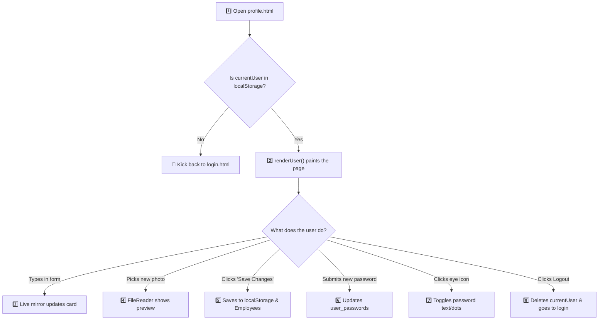

# 👤 Profile Page Logic — Simple & Clear Explanation

> A complete, beginner-friendly walkthrough of the simplified [`profile.js`](file:///c:/Users/user/Desktop/TASKMANAEMENTSYS/GAITH/profile/profile.js) (155 lines total).

---

## 🗺️ The Big Picture: 8 Simple Steps

The entire profile page is built in **8 clean steps**:



---

## 🚪 STEP 1: The Login Gate (Lines 1–5)

```javascript
// 1. Get current logged-in user (if not logged in -> redirect to login)
let user = JSON.parse(localStorage.getItem("currentUser"));
if (!user) {
  window.location.href = "../login.html";
}
```

### What it does:
* Checks the browser's `localStorage` for `"currentUser"`.
* If **nobody is logged in** (`null`) $\rightarrow$ instantly redirects the browser to `login.html`.
* If **logged in** $\rightarrow$ stores their data in the variable `user`.

---

## 🎨 STEP 2: Displaying Info & Setting Permissions (Lines 8–58)

The function `renderUser()` does all the heavy lifting of filling the page.

### 1. Fill the Left Summary Card & Navbar (Lines 13–25)
```javascript
document.getElementById("cardFullName").textContent = user.name || "User";
document.getElementById("cardPosition").textContent = user.position || (isHR ? "HR Manager" : "Specialist");
document.getElementById("cardDepartment").textContent = user.department || "General";
document.getElementById("cardEmail").textContent = user.email || "";
document.getElementById("cardPhone").textContent = user.phone || "N/A";
document.getElementById("cardRoleBadge").textContent = isHR ? "HR ADMIN" : "EMPLOYEE";
document.getElementById("cardProfileImg").src = avatar;
document.getElementById("photoPreviewImg").src = avatar;
```
* Takes the user's data and writes it into the text labels and image sources on the page.

### 2. Fill the Form Inputs (Lines 28–32)
```javascript
document.getElementById("editNameInput").value = user.name || "";
document.getElementById("editPositionInput").value = user.position || "";
document.getElementById("editDepartmentInput").value = user.department || "";
document.getElementById("editPhoneInput").value = user.phone || "";
document.getElementById("editEmailInput").value = user.email || "";
```
* Pre-fills the input text boxes with what's currently saved so the user can see what to edit.

### 3. Role Permissions — HR vs. Employee (Lines 34–57)
```javascript
// HR can edit all info; Employees can only edit phone & photo
document.getElementById("editNameInput").readOnly = !isHR;
document.getElementById("editPositionInput").readOnly = !isHR;
document.getElementById("editDepartmentInput").readOnly = !isHR;
```

#### What's the difference between roles?
| Feature | 👤 Employee | 👔 HR Admin |
|---|---|---|
| **Name, Position, Department** | 🔒 `readOnly = true` (Locked) | ✏️ `readOnly = false` (Editable) |
| **Lock Icons** | Shown 🔒 | Hidden |
| **Phone & Photo** | ✏️ Editable | ✏️ Editable |
| **Sidebar / Layout** | Employee Header & Footer | HR Dark Sidebar |
| **Back Link** | Home page (`home.html`) | HR Dashboard (`hrdashboard.html`) |

---

## 🪞 STEP 3: Live Mirroring When Typing (Lines 60–66)

```javascript
document.getElementById("editPhoneInput").oninput = (e) => {
  document.getElementById("cardPhone").textContent = e.target.value.trim() || "N/A";
};
document.getElementById("editNameInput").oninput = (e) => {
  document.getElementById("cardFullName").textContent = e.target.value.trim() || "User";
};
```

### What it does:
* While you type a new phone number or name, `.oninput` fires on every keystroke.
* The summary card on the left updates **immediately in real time**, like looking into a magic mirror! 🪞

---

## 📸 STEP 4: Changing Profile Picture (Lines 69–79)

```javascript
document.getElementById("imageFileInput").onchange = (e) => {
  const file = e.target.files[0];
  if (!file) return;
  const reader = new FileReader();
  reader.onload = () => {
    user.profilePicture = reader.result;
    document.getElementById("cardProfileImg").src = reader.result;
    document.getElementById("photoPreviewImg").src = reader.result;
  };
  reader.readAsDataURL(file);
};
```

### What it does:
1. When you select a photo from your computer, `FileReader` converts it into a Base64 image string (`reader.result`).
2. It temporarily saves it to `user.profilePicture`.
3. It updates both avatar images on the page immediately so you see your new photo preview.

---

## 💾 STEP 5: Saving Changes (Lines 82–105)

When you click the **"Save Changes"** button:

```javascript
document.getElementById("profileEditForm").onsubmit = (e) => {
  e.preventDefault();

  // 1. Grab values from the inputs
  if (user.role === "hr") {
    user.name = document.getElementById("editNameInput").value.trim() || user.name;
    user.position = document.getElementById("editPositionInput").value.trim() || user.position;
    user.department = document.getElementById("editDepartmentInput").value.trim() || user.department;
  }
  user.phone = document.getElementById("editPhoneInput").value.trim() || user.phone;

  // 2. Save current user to localStorage
  localStorage.setItem("currentUser", JSON.stringify(user));

  // 3. Keep the company-wide Employees database in sync
  const emps = JSON.parse(localStorage.getItem("Employees")) || [];
  localStorage.setItem("Employees", JSON.stringify(emps.map((emp) => (emp.id === user.id ? { ...emp, ...user } : emp))));

  // 4. Show green success banner for 3 seconds
  const alertBox = document.getElementById("statusAlert");
  if (alertBox) {
    document.getElementById("statusAlertText").textContent = "Profile updated successfully!";
    alertBox.className = "profile-alert-banner alert-success";
    alertBox.classList.remove("d-none");
    setTimeout(() => alertBox.classList.add("d-none"), 3000);
  }
};
```

### Why update both `currentUser` and `Employees`?
* **`currentUser`:** Remembers YOUR active session.
* **`Employees`:** Remembers the global company directory that other pages (like HR Dashboard or Team Directory) read from. Updating both keeps everything synchronized.

---

## 🔑 STEP 6: Changing Password (Lines 108–128)

```javascript
document.getElementById("passwordResetForm").onsubmit = (e) => {
  e.preventDefault();
  const p1 = document.getElementById("newPasswordInput").value;
  const p2 = document.getElementById("confirmPasswordInput").value;

  // 1. Validate matching passwords
  if (!p1 || p1 !== p2) {
    alert("Passwords do not match or cannot be empty.");
    return;
  }

  // 2. Save to currentUser
  user.password = p1;
  localStorage.setItem("currentUser", JSON.stringify(user));

  // 3. Save to user_passwords (the table login checks against)
  const pwMap = JSON.parse(localStorage.getItem("user_passwords")) || {};
  pwMap[user.email.toLowerCase()] = p1;
  localStorage.setItem("user_passwords", JSON.stringify(pwMap));

  alert("Password changed successfully!");
  document.getElementById("newPasswordInput").value = "";
  document.getElementById("confirmPasswordInput").value = "";
};
```

### What it does:
1. Makes sure you didn't leave it blank and both inputs match (`p1 === p2`).
2. Updates `user.password` in `currentUser`.
3. Saves it into `user_passwords` map in `localStorage`, so when you log out and log in again, your new password works!

---

## 👁️ STEP 7: Show / Hide Password (Lines 131–142)

```javascript
function setupToggle(btnId, inputId, iconId) {
  const btn = document.getElementById(btnId);
  if (!btn) return;
  btn.onclick = () => {
    const input = document.getElementById(inputId);
    const isPass = input.type === "password";
    input.type = isPass ? "text" : "password";
    document.getElementById(iconId).className = isPass ? "bi bi-eye" : "bi bi-eye-slash";
  };
}
setupToggle("toggleNewPasswordBtn", "newPasswordInput", "toggleNewPasswordIcon");
setupToggle("toggleConfirmPasswordBtn", "confirmPasswordInput", "toggleConfirmPasswordIcon");
```

### What it does:
* Clicking the eye icon button flips `input.type`:
  * If it's `"password"` (dots `••••`), change it to `"text"` (visible letters).
  * If it's `"text"`, change it back to `"password"`.
* Flips the Bootstrap eye icon between `bi-eye` and `bi-eye-slash`.

---

## 🚪 STEP 8: Logging Out (Lines 145–152)

```javascript
function logout() {
  localStorage.removeItem("currentUser");
  window.location.href = "../login.html";
}
window.logout = logout;
window.doLogout = logout;
const logoutBtn = document.getElementById("navLogoutBtn");
if (logoutBtn) logoutBtn.onclick = logout;
```

### What it does:
1. Deletes `"currentUser"` from `localStorage`.
2. Instantly redirects to `../login.html`.

---

## 🚀 The Kickoff (Line 155)

```javascript
// Run on page load
renderUser();
```
* As soon as the script finishes loading, it calls `renderUser()` to draw the user's data onto the screen!

---

## 🔗 Quick Reference: HTML vs. JavaScript

| Action | HTML Element | Trigger | JavaScript Does |
|---|---|---|---|
| **Page Loads** | `<script src="profile.js">` | Auto-runs | Checks login & runs `renderUser()` |
| **Type phone** | `<input id="editPhoneInput">` | `.oninput` | Mirrors phone to left card |
| **Type name (HR)**| `<input id="editNameInput">` | `.oninput` | Mirrors name to left card |
| **Pick photo** | `<input id="imageFileInput">` | `.onchange` | Reads file & updates avatar preview |
| **Save info** | `<form id="profileEditForm">` | `.onsubmit` | Saves changes to `currentUser` & `Employees` |
| **Change pass** | `<form id="passwordResetForm">`| `.onsubmit` | Verifies match & saves to `user_passwords` |
| **Eye icon** | `<button id="toggleNewPasswordBtn">` | `.onclick` | Switches text $\leftrightarrow$ password |
| **Logout** | `<button id="navLogoutBtn">` | `.onclick` | Removes `currentUser` $\rightarrow$ `login.html` |
